# swift-android-tutorial


# Steps to create an swift android project

### 1 Configure `swift-android-gradle` on macOS

This tool adds some gradle scripts on the build life cycle to generate Swift code and copy the binaries `*.so` on jniLibs folder.

* Download the [Swift Android Toolchain](http://johnholdsworth.com/android_toolchain.tgz).

* Decompress the `*.tgz` and change directory to the `swift-install` folder.

* Export the `ANDROID_HOME` and `JAVA_HOME` paths. 

 ```
export ANDROID_HOME=/Users/jmarkstar/Library/Android/sdk

export JAVA_HOME=/Library/Java/JavaVirtualMachines/jdk1.8.0_151.jdk/Contents/Home
```
* Execute `./setup.sh`

That script should copy some gradle scripts and the plugin for the android project.

#### Gradle Scripts

Path

```
   ~/.gradle/scripts
```

<p align="center">
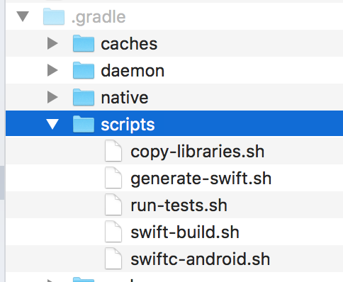
</p>

#### Gradle Plugin on Maven

Path

```
   ~/.m2/net/zhuoweizhang/swiftandroid/1.0.0
```

<p align="center">
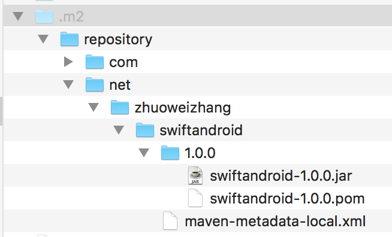
</p>

### 2 Create and Configure an Android Project

#### 2.1 Create a normal android project using Java using the wizard.

#### 2.2 Configure the root ```build.gradle```

##### Open the `build.gradle` File

<p align="center">

</p>

#### Add the mavenLocal() repository and the dependency

<p align="center">
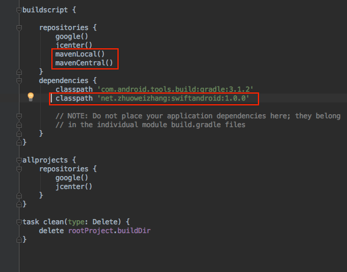
</p>

#### 2.3 Configure the app ```build.gradle```

<p align="center">
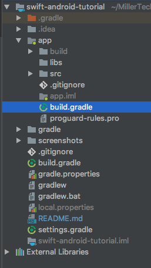
</p>

#### Add the plugin on the App

<p align="center">
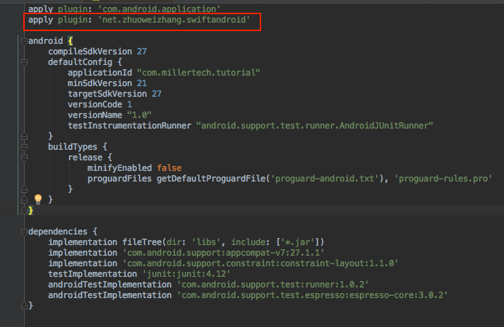
</p>

### 3 Add the bindings Java <-> Swift

#### 3.1 Create the package `com.johnholdsworth.swiftbindings`

#### 3.2 Create the java `interface`

```
package com.johnholdsworth.swiftbindings;

public interface SwiftMathBinding {

    // Messages from JavaActivity to Swift
    public interface Listener {
        public void processSum( int num1, int num2 );
    }

    // Messages from Swift back to Activity
    public interface Responder {
        public void processedSum(int result);
    }
}
``` 

### 4 Implement the bindings on your Activity

#### 4.1 Implement the `SwiftMathBinding.Responder` on the Activity.

### 4.2 Create the `native` method `SwiftMathBinding.Listener bind( SwiftMathBinding.Responder )`

#### 4.3 Crate a `SwiftMathBinding.Listener` variable.

```
package com.millertech.tutorial;

import android.support.v7.app.AppCompatActivity;
import android.os.Bundle;
import android.util.Log;
import com.johnholdsworth.swiftbindings.SwiftMathBinding.Listener;
import com.johnholdsworth.swiftbindings.SwiftMathBinding.Responder;

public class MainActivity extends AppCompatActivity implements Responder {

    public static final String TAG = "MainActivity";

    @SuppressWarnings("JniMissingFunction")
    native Listener bind(Responder self);

    private static void loadNativeDependencies() {
        System.loadLibrary("swiftandroid");
    }

    Listener listener;

    @Override protected void onCreate(Bundle savedInstanceState) {
        super.onCreate(savedInstanceState);
        setContentView(R.layout.activity_main);

        loadNativeDependencies();
        listener = bind(this);

        listener.processSum(200, 200);
    }

    @Override
    public void processedSum(int result) {

        Log.v(TAG, "El resultado es "+result);

    }
}
```

### 5 Create the `swift` folder on `/src/main/swift`

<p align="center">
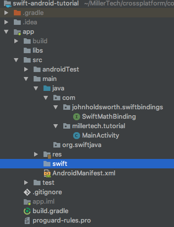
</p>

### 6 Build The Project to Generate the swift stuffs.

####  6.1 Execute `./gradlew installDebug` on the command line of android studio.

<p align="center">
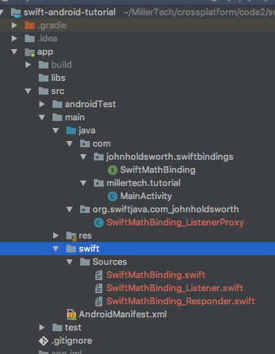
</p>	

#### 6.2 Add Package Manager

<p align="center">
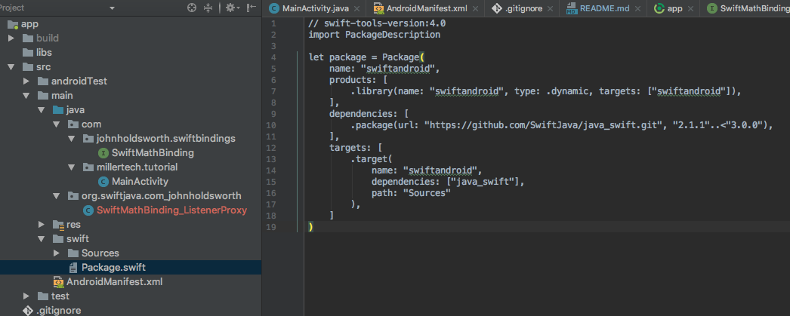
</p>

#### 6.4 Generate the xcode open 
 
<p align="center">
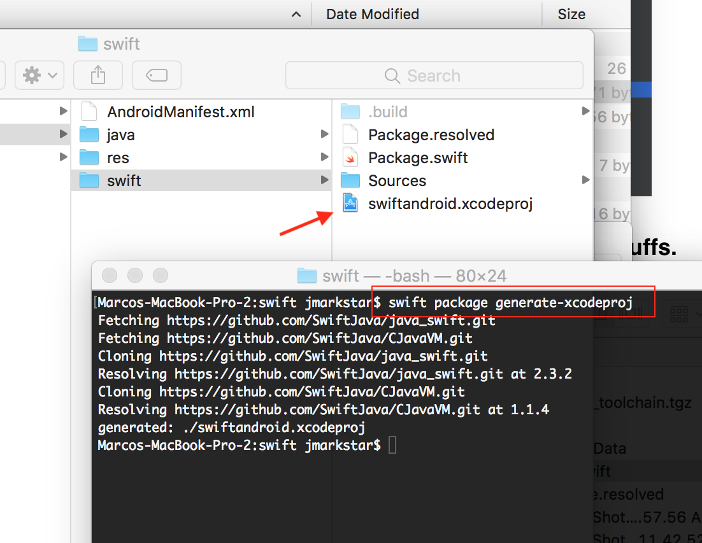
</p>

#### 6.3 Implement the native method `bind()` and the `Listener` on swift.

<p align="center">
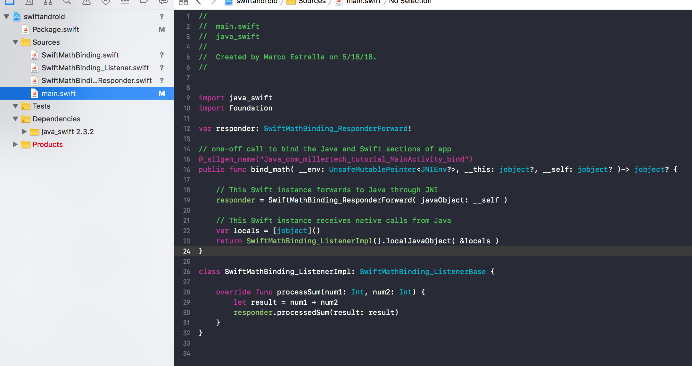
</p>

### Run and Buhala!

<p align="center">
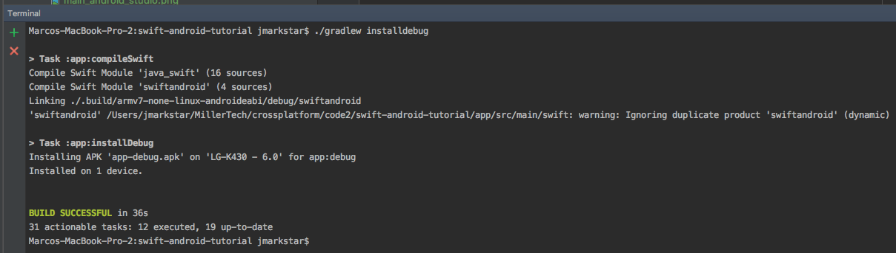
</p>

It generated the native libraries.

<p align="center">
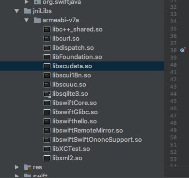
</p>

<p align="center">
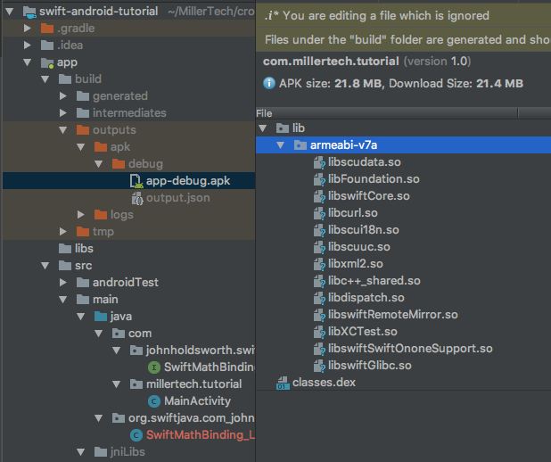
</p>